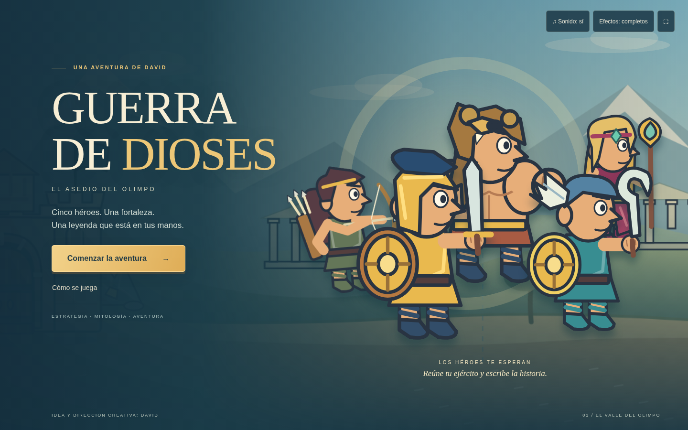
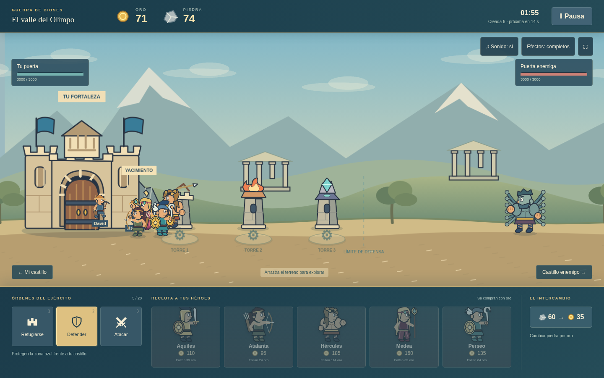

# Guerra de Dioses — El asedio del Olimpo

Un juego de estrategia lateral para navegador, basado en las ideas y la dirección creativa de **David**. Una batalla completa: reúne recursos, recluta a los cinco héroes, protege tu fortaleza y rompe la puerta roja **para entrar** en el castillo enemigo.



## Jugar en local

Requisitos: **Node.js 24 LTS**, npm y un navegador moderno con WebGL. No hay cuentas, servicios de pago, CDN, anuncios ni servidor de aplicación.

```bash
npm install
npm run dev
```

Abre **http://localhost:5173**. Si el puerto está ocupado, Vite indica el puerto elegido en la terminal. La primera ejecución genera las ilustraciones originales antes de arrancar. Después de instalar dependencias, el desarrollo y el juego funcionan sin conexión a servicios externos.

### Compilar y servir la versión distribuible

```bash
npm run build
npm run preview
```

Abre **http://localhost:4173**. `dist/` contiene el juego completo para un servidor estático. No abrir `index.html` mediante `file://`: las texturas y los módulos necesitan HTTP. La variable `VITE_BASE_PATH` permite compilar para una subcarpeta; HTML, interfaz y texturas de Phaser respetan esa ruta.

Las fotografías de referencia y el archivo de especificaciones son material local opcional, excluido de Git y de `dist/`. No hacen falta para ejecutar, probar ni compilar. Para distribuir el juego, distribuye únicamente `dist/`.

## GitHub Pages y ramas

- **Release:** https://dpeletier16.github.io/guerra-de-dioses/master/
- **Desarrollo:** https://dpeletier16.github.io/guerra-de-dioses/dev/
- **Índice de versiones:** https://dpeletier16.github.io/guerra-de-dioses/
- **Repositorio:** https://github.com/dpeletier16/guerra-de-dioses

`dev` es la rama por defecto; `master` contiene las releases. Ambas parten del mismo commit inicial. Cada push a una rama (excepto `gh-pages`) ejecuta pruebas, compila y actualiza su propia carpeta en Pages. También se puede lanzar **Publicar ramas en GitHub Pages** manualmente desde Actions seleccionando la rama.

Una rama `feature/torres` se publica en `/guerra-de-dioses/feature/torres/`. Las demás publicaciones se conservan al actualizar una rama, incluidas las ramas anidadas. `version.json`, dentro de cada carpeta, identifica la rama y el commit publicado. La raíz presenta enlaces a todas las versiones publicadas.

La rama técnica `gh-pages` conserva únicamente el sitio compilado y sus manifiestos; el despliegue se realiza mediante GitHub Actions/Pages. El workflow serializa las publicaciones del sitio compartido y mantiene una cola de hasta 100 ejecuciones pendientes (`queue: max`) para no sustituir una publicación pendiente por la de otra rama. Borrar una rama de código no elimina automáticamente su última publicación.

Para preparar una release a partir de desarrollo:

```bash
git switch master
git merge --ff-only dev
git push origin master
git switch dev
```

Comprobación local de una compilación con prefijo:

```bash
VITE_BASE_PATH=/guerra-de-dioses/dev/ npm run build
npm run preview
# Abrir http://localhost:4173/guerra-de-dioses/dev/
```

Después, `npm run build` sin esa variable vuelve a generar una compilación local para `/`.

## Cómo jugar

1. Pulsa **Comenzar la aventura**. En el mapa, toca el encuentro de espada y escudo.
2. Pon nombre a los dos campesinos o acepta los predeterminados. Extraen oro y piedra, llenan sus recipientes y entregan la carga en tu castillo.
3. Compra héroes con **oro**. Aquiles es una buena primera defensa; Atalanta y Medea atacan a distancia.
4. Pulsa un emplazamiento **+** para construir una torre con **piedra**. También puedes pulsar la torre o su plataforma para desmontarla.
5. **Defender** conserva el ejército cerca de tu castillo. **Refugiarse** lo retira al interior mientras la puerta esté intacta. **Atacar** inicia el avance contra la fortaleza roja.
6. La destrucción de una puerta no termina la partida: **un combatiente vivo debe cruzar su entrada**. La regla es igual para ambos bandos.

### Controles

Todas las decisiones principales se pueden tomar con ratón o toque.

| Acción | Control visible | Atajo opcional |
|---|---|---|
| Refugiarse / defender / atacar | Tres botones inferiores | `1` / `2` / `3` |
| Reclutar | Cinco tarjetas con precio y disponibilidad | — |
| Construir / desmontar | Emplazamiento o torre del terreno | — |
| Convertir piedra en oro | Panel de intercambio | — |
| Explorar el terreno | Arrastrar / botones de castillos | `A` / `D`, flechas |
| Pausar / continuar | Pausa | `Esc` |
| Silenciar | Sonido | `M` |
| Reducir movimiento y partículas | Efectos | — |
| Pantalla completa | ⛶ | — |

Cambiar de pestaña pausa la batalla automáticamente. La pausa congela minería, IA, ataques, proyectiles y efectos de combate. Nombres, sonido y efectos se conservan en `localStorage` cuando está disponible.

## Qué incluye

- Carga, menú, ayuda, mapa con banderas lisas enfrentadas, preparación de campesinos, tutorial omisible, pausa y resultado con reinicio.
- **Aquiles:** espada y escudo, reducción frontal del daño y ninguna debilidad en el talón.
- **Atalanta:** arco, carcaj, carrera rápida y separación frente a enemigos próximos.
- **Hércules:** piel del león de Nemea, gran resistencia y puñetazos.
- **Medea:** diadema con gema, bastón añadido y fuego con daño en área.
- **Perseo:** casco alado, escudo dorado y hoz curva.
- Minotauro, Cíclope, Centímano de múltiples brazos, Cerbero de tres cabezas y Cronos, controlados por oleadas. Cronos es una unidad de la IA, no un jefe narrativo.
- Torres de flechas, fuego en área y magia con ralentización; vida propia, destrucción y desmontaje con devolución.
- Puertas agrietadas y destructibles, barras de vida contextuales, proyectiles con tiempo de vuelo, impacto, desaparición y partículas.
- Escenario vectorial original en cuatro planos con paralaje, nubes, ruinas, sombras y cámara horizontal. Animaciones por poses, desplazamiento y anticipación visual.
- Efectos sintetizados originales y una ambientación musical modal sencilla mediante Web Audio. El audio se activa después de una interacción y puede silenciarse.
- Diseño principal para ordenador; adaptación horizontal a teléfonos y tabletas y aviso de orientación vertical.



## Pruebas reproducibles

```bash
npm test                  # Reglas, partidas deterministas y publicación por ramas
npm run test:balance      # Cuatro perfiles con resultados, tiempos y enemigos vistos
npx playwright install chromium
npm run test:e2e          # 6 recorridos de navegador, estrés y capturas
```

En Linux, si Chromium informa de bibliotecas del sistema ausentes, el instalador oficial permite `npx playwright install --with-deps chromium` (puede requerir permisos administrativos). La configuración usa el canal Chromium completo, no el ejecutable headless-shell.

Playwright inicia Vite si no está activo y usa un solo trabajador. Las partidas largas se aceleran con el mismo modelo de simulación a pasos de 1/60 s: no se alteran estadísticas ni recursos en las pruebas de victoria/derrota. **Solo la prueba de estrés** prepara recursos abundantes y 24 monstruos para ejercitar 20 héroes y cinco reinicios.

Resultados observados y límites de verificación: **[docs/QA.md](docs/QA.md)**. Las capturas están en `docs/screenshots/`; Playwright conserva trazas de los fallos en `test-results/`.

## Estructura

```text
src/
  main.ts            Arranque y configuración de Phaser 4
  config.ts          Datos tipados, unidades, torres y balance
  model.ts           Simulación determinista independiente del motor
  scene.ts           Cámara, sprites, animación, entrada y efectos
  ui.ts              Menú, mapa, preparación, HUD, pausa y resultado
  style.css          Presentación y adaptación a pantallas
  art.ts             Fuente de todas las ilustraciones vectoriales
  audio.ts           Síntesis de efectos, música y preferencias
scripts/
  export-art.ts      Genera SVG transparentes y hoja de personajes
  balance.ts         Simula cuatro estrategias sin navegador
  pages.ts           Actualiza una carpeta de rama sin borrar las demás
public/art/          89 SVG originales exportados, incluidos poses y escenarios
tests/               Reglas y partidas completas con Vitest
e2e/                 Interfaz y partidas con Playwright/Chromium
docs/                Evidencias y notas de producción
.github/workflows/   Publicación automática de ramas en Pages
```

Se mantiene una arquitectura pequeña: un modelo puro, una escena de representación y pantallas HTML/CSS. Los sistemas de economía, objetivos, IA y combate se agrupan en `model.ts`; no se necesita un motor de física para este carril lateral continuo.

Solo en desarrollo se expone `window.__game` para inspección, avance acelerado y pruebas. El compilado de producción elimina ese bloque.

## Balance provisional que David puede cambiar

Todo el balance está en **`src/config.ts`**:

| Parámetro | Valor actual |
|---|---:|
| Oro / piedra inicial | 140 / 45 |
| Campesinos iniciales | 2, gratuitos y no atacables |
| Carga por campesino | 22 oro + 13 piedra |
| Minería / velocidad del campesino | 3,1 s / 65 unidades por segundo |
| Límite de héroes vivos | 20 |
| Conversión | 60 piedra → 35 oro |
| Emplazamientos | 3 |
| Desmontaje voluntario | 100 % de la piedra pagada |
| Resistencia de cada puerta | 3000 |
| Primera aparición enemiga | 25 s |
| Intervalo de oleadas | 19 s, disminuyendo gradualmente hasta 9 s |

Las estadísticas de cada héroe y monstruo, rangos, cadencias, efectos secundarios, posiciones y secuencia de oleadas también son editables. No hay límite de reservas. Los héroes se pueden reclutar varias veces. Una torre destruida por el enemigo no devuelve piedra.

Se aumentó la vida de las puertas durante las pruebas para permitir que aparezcan los cinco monstruos antes de una victoria ofensiva normal. Las estrategias automatizadas ganan en **2:24–3:46**; son más rápidas que la orientación de 4–8 minutos del documento. Es una primera calibración asequible, sujeta a probar con David, no un balance validado con jugadores.

## Arte, referencias y licencias

Durante la producción se inspeccionaron realmente las cinco fotografías locales de referencia. Esos archivos no se incluyen en el repositorio. Se crearon reinterpretaciones vectoriales propias, sin recortar ni calcar las páginas. Se conservaron los rasgos requeridos, se añadió el bastón de Medea y se excluyeron bocadillos, textos y su dragón. No se ha usado contenido de *War of Sticks*.

`src/art.ts` es la fuente editable de los 89 SVG; `npm run assets` los regenera. `public/art/roster.svg` permite revisar los diez personajes juntos. Son ilustraciones vectoriales coherentes con animación programática limitada, no animación dibujada fotograma a fotograma de producción profesional. El Centímano expresa muchos brazos con un abanico simplificado, no cien extremidades simuladas individualmente.

Los sonidos y la composición ambiental se generan desde `src/audio.ts`: su código forma parte del proyecto; no se han descargado grabaciones. No se conectó ningún generador de imágenes ni servicio musical. Véase **[THIRD_PARTY.md](THIRD_PARTY.md)** para las dependencias y sus licencias.

## Límites conocidos

- Una batalla, sin campaña, multijugador ni guardado de una partida en curso.
- Pruebas realizadas en Chromium/Linux; Firefox, Safari, dispositivos móviles físicos y calidad acústica en altavoces no verificados.
- En pantallas horizontales muy bajas se recorta parte del cielo y de los tejados para mantener legibles los combatientes. El ordenador es la plataforma principal.
- Con ejércitos numerosos puede haber solapamiento visual entre combatientes de una misma línea; hay cuatro alturas de representación, pero no formaciones militares complejas.
- La música es una ambientación sintetizada breve, no una banda sonora orquestal.
- El motor Phaser completo genera un aviso de tamaño de paquete de Vite; el juego compila correctamente. El motor ocupa aproximadamente 372 KB comprimidos con gzip y el código propio unos 16 KB, además del arte.

El nombre «Guerra de Dioses — El asedio del Olimpo», los números y las decisiones operativas anteriores son provisionales. Las decisiones creativas de David tienen prioridad.
